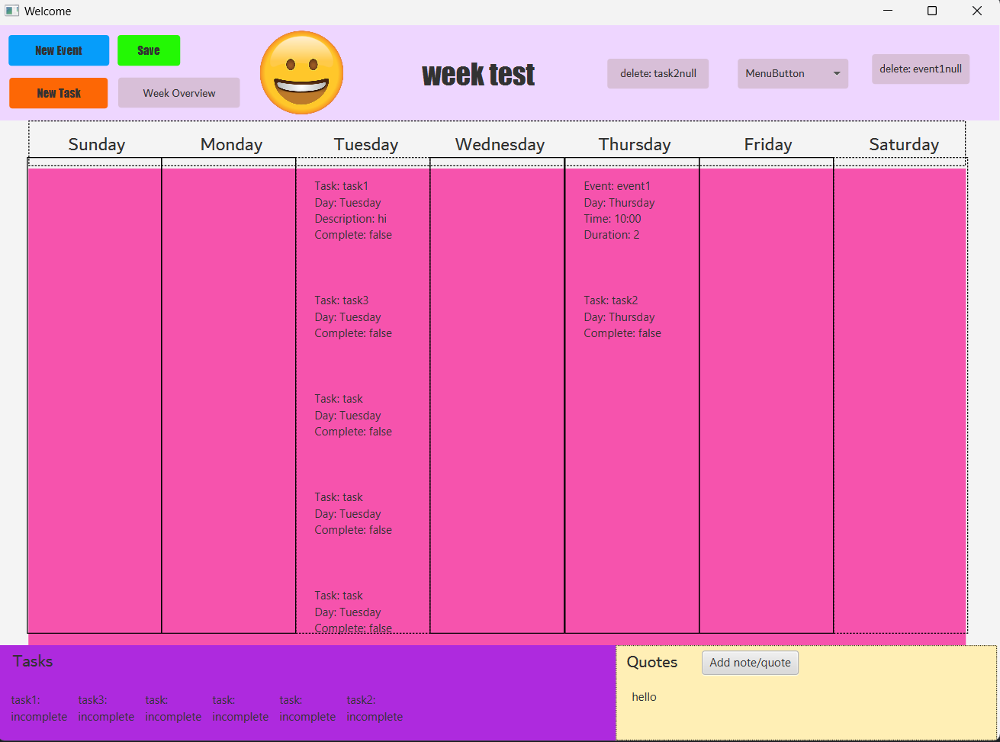
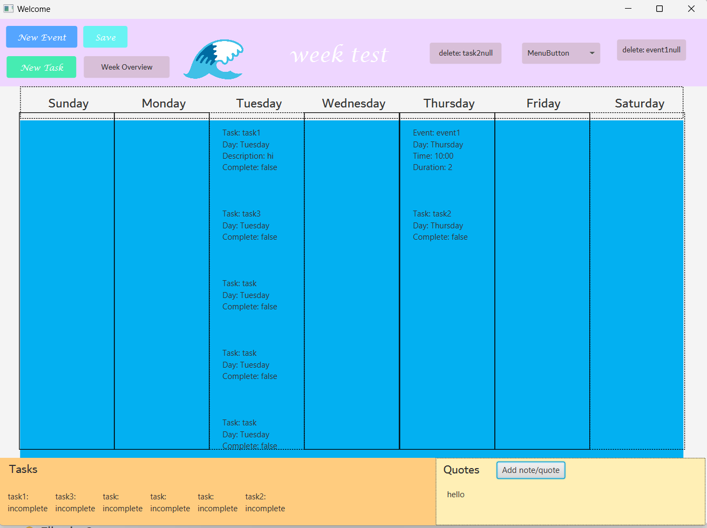
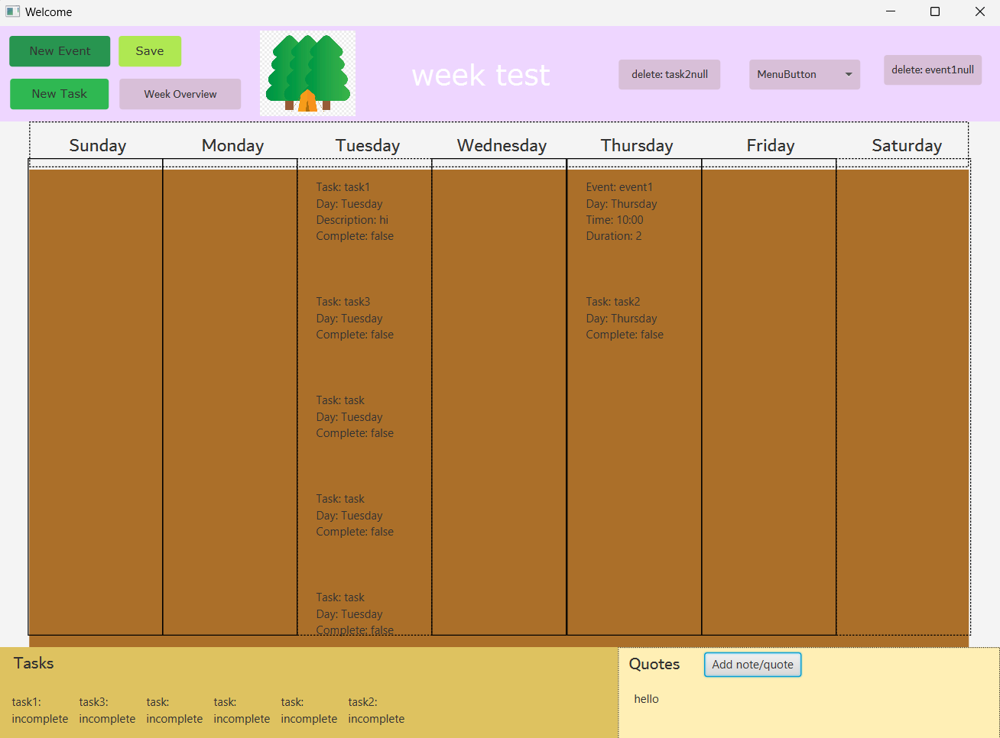
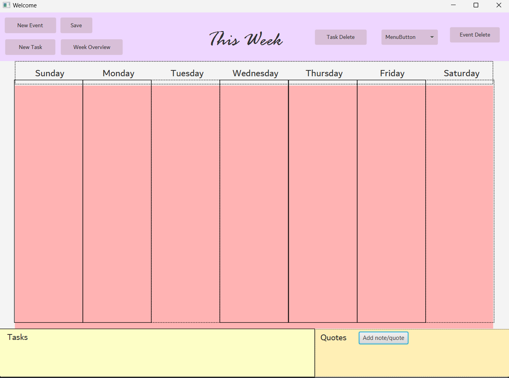

# 3500 PA05 Project Repo

[PA Write Up](https://markefontenot.notion.site/PA-05-8263d28a81a7473d8372c6579abd6481)

# App Pitch
- Introducing "Bujo Week", an aesthetic and intricate digital planner to better plan your weeks. This app offers many
features to enhance your creativity and organization. From the beginning, users can pick from three built in themes, or 
customize one of their own by changing the background color! Additionally, users can customize their weekly bullet journal
with quick notes or meaningful quotes. However, this app's best quality is its ability to show the  user the big pictures.
From a weekly overview that shows the user the total number of events, tasks, and percentage of tasks completed to a task 
queue that keeps track of every task and whether it is completed or not for a quick peek at the week. However, if the 
week seems too crowded and overbearing, the app comes with a delete button to easily remove events or tasks for easier 
user interaction. All week journals are customizable everytime they open, allowing the user to continiuously change
the week name, week theme, and weekly event and task limits. All week journals are saved for the user to open at any time.

# SOLID Principles
## Single Responsibility
- Each class in our program has one single responsibility. In our code, every class is used for one task. As an example, 
our biggest class, WeekController, while having almost 500 lines of code, has one single responsibility: controlling the week.
It works to connect the view and the model to effectively run the week gui. This separation allows for better flexibility,
as changing one class in our program only requires slight changing in each connected class.

## Open-Closed Principle
- All the classes in our program are open for extension and closed for modification. Our code utilizing interfaces in 
order to add new features to the program. One example is our control interface, with has the method run. This allows
extensibility with new features in the view and model classes without modifying the original code to implement the 
features. 

## Liskov Substitution:
- All the subclasses in our program inherit the supertypes methods and makes use of them. For example, with the controller interface,
the subclasses implement the same public methods of the interface and can be used interchangeably to control a portion of the program.

## Interface Segregation Principle:
- All methods inherited by the subclasses in this program are used by the subclasses. All methods are related to the 
common behavior of each class and avoids the unnecessary dependencies for the class that use each supertype. Additionally,
as we were building the program, we originally had all model package classes implementing a model interface. However, by following the
I in the SOLID principles, we found that there isn't any common behavior and an interface is unnecessary.

## Dependency Inversion Principle:
- Many of the fields in the classes are interfaces or extended classes. As an example, List<> is used more often than a 
specific type of List, allowing the class to be decoupled from specific implementations because many times we had to convert 
from linked lists to arraylist due to implementation changes. It also allowed us to test the specific type of field, 
ex: an ArrayList vs a List, without any errors. 

# Program Extension
- One extension to this program could be implementing a "grow your plant" mini game to make the bullet journal more aesthetic
and entertaining. This feature is a big hit amongst users as it encourages them to look at their planners in order to keep 
their pet plants alive. The implementation would require a plant controller, view, class, and record to keep track of the 
total growth of the plant. Implementation would probably count up the total number of completed tasks and add green blocks,
or more detailed picture of a plant, per completed task. However, this feature could also be extended to setting the plant
back to empty/clear if it is the end of the week and there are more than, for example, 10 tasks left incomplete.

# Screenshots of Week GUI

# Images Sources for Icons
- https://upload.wikimedia.org/wikipedia/commons/thumb/7/7e/Emoji_u1f30a.svg/1024px-Emoji_u1f30a.svg.png
- https://www.clipartmax.com/png/middle/118-1181813_emoji-forest-forest-emoji.png
- https://cdn.shopify.com/s/files/1/1061/1924/products/Smiling_Face_Emoji_large.png?v=1571606036